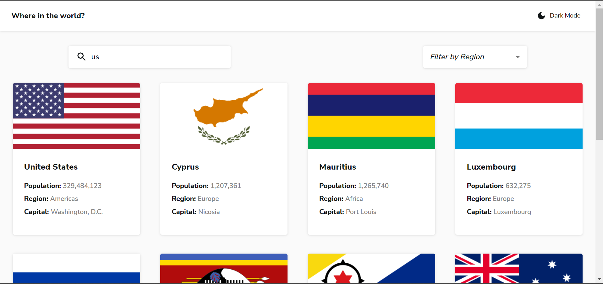

# REST Countries API with color theme switcher 

## Table of contents

- [Overview](#overview)
  - [The challenge](#the-challenge)
  - [Screenshot](#screenshot)
  - [Links](#links)
- [My process](#my-process)
  - [Built with](#built-with)
  - [What I learned](#what-i-learned)
  - [Useful resources](#useful-resources)
- [Author](#author)

## Overview

### Functionality

Users are able to:

- See all countries from the API on the homepage
- Search for a country using an `input` field
- Filter countries by region
- Click on a country to see more detailed information on a separate page
- Click through to the border countries on the detail page
- Toggle the color scheme between light and dark mode

### Screenshot

### Links

- [Github repo URL](https://github.com/Danny-Lenko/r-fm-rest-countries)
- [Live site URL](r-fm-rest-countries.vercel.app)

## My process

### Built with

- [React](https://reactjs.org/) - JS library
- [TS](https://www.typescriptlang.org/) - JS superset programming language
- [Redux](https://redux.js.org/) - JS apps state manager
- [MUI](https://mui.com/) - React UI framework

### What I learned

1) Customize the Select component in MUI:
  [StackOverflow](https://stackoverflow.com/a/73218337/16906724)

- [Scrimba](https://scrimba.com/) - The educational platform for learning Frontend with the huge community
- [Foxminded](https://foxminded.ua/) - The mentoring based educational platform with wide variety of technologies

## Author

<!-- - My Portfolio - [Danny Lenko]() -->
- LinkedIn - [ValeriiDanylenko](https://www.linkedin.com/in/valerii-danylenko-74379212b/)
- Github - [Danny-Lenko](https://github.com/Danny-Lenko)
- Facebook - [Valerii Danylenko](https://www.facebook.com/valerii.danylenko)